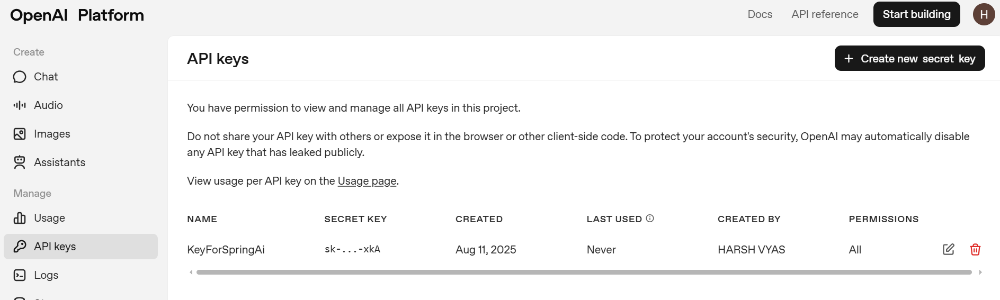

Setting Up OpenAI API with a Spring Boot Application :
1. Access the OpenAI API Platform
   Go to the OpenAI home page.

Click on Login and select the API Platform.

2. Set Up Billing
   Note: The OpenAI API is not free.

Navigate to the Billing section and add credits to your account.

3. Generate an API Key
   Go to the API Keys section in your OpenAI dashboard.

Click Create new secret key.

Copy the generated key and add it to your application.properties file:

properties

openai.api.key=your-api-key-here

4. Create a REST Controller in Spring Boot
   Create a controller class and define a GET endpoint.

Accept a path parameter (e.g., a prompt) through Postman.

5. Integrate the Chat Model
   Use the Chat model (like gpt-3.5-turbo) to act as a mediator between your Spring Boot application and the OpenAI API.

You’ll send the user's prompt to the chat model and return the response.

6. Testing the Endpoint
   Use Postman to test your endpoint.

Example request:
GET http://localhost:8080/api/tell%20me%20a%20tech%20joke

----------------

ChatClient Integration
A ChatClient class has been created to interact with the OpenAI Chat model.

This client is responsible for:

Sending user prompts to the OpenAI API.

Receiving and returning the model's response.

It acts as a middleware between the Spring Boot application and the OpenAI backend.

This approach keeps the codebase modular and makes API communication reusable and easy to manage.

--------------
Use chatResponse() when you need more than just text

.chatResponse() gives access to metadata like model name, tokens used, etc.

Use this instead of just .getResult().getOutput().getText() if you need rich data.

Logging the model used is helpful for debugging and analytics

chatResponse.getMetadata().getModel() gives you the model name (e.g., gpt-4-turbo).

------------------

When we use multiple LLM's ,it is important to structure your code so that you can easily switch or configure different providers (like OpenAI, Azure OpenAI, Mistral, etc.). :

public OpenAIController(ChatClient.Builder builder){
this.chatClient = builder.build();

--------------

It's not llm feature to store data and for that we use advisor📝 Notes on Chat Memory Setup in OpenAIController

ChatMemory chatMemory = MessageWindowChatMemory.builder().build();
Creates a chat memory instance that stores recent conversation messages in a sliding window (a fixed-size context).
This enables the model to maintain conversational context across multiple calls.

ChatClient.Builder with .defaultAdvisors(...)

The builder is configured with a MessageChatMemoryAdvisor which uses the chatMemory.

Advisors can modify, enhance, or influence chat requests/responses dynamically.

Here, it integrates memory into the chat flow, so each prompt is aware of recent chat history.

In the constructor:

chatClient is built with memory support so the controller handles conversations with state, not just isolated prompts.

-------------

💡 Using Ollama as a Local Alternative to OpenAI
OpenAI API is paid, so we can use Ollama to run models like Mistral locally.

After installing Ollama, start a model with:

ollama run mistral
No API key is required. Instead, specify the model name in application.properties:

properties

spring.ai.ollama.chat.options.model=deepseek-r1:7b

